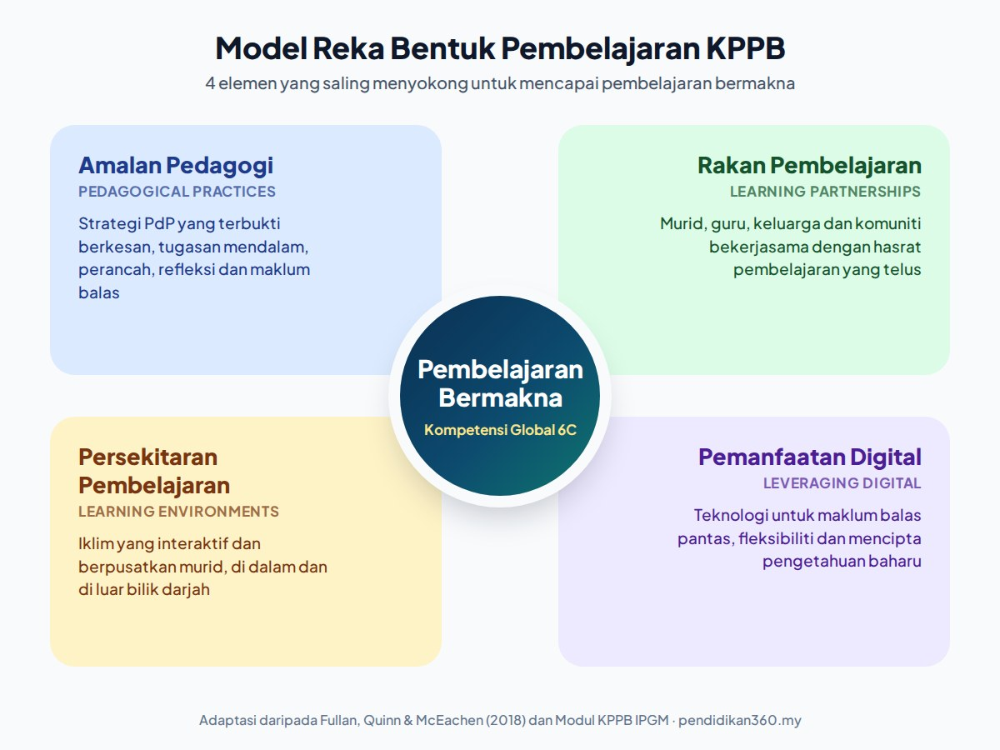

**Elemen KPPB** yang paling kerap ditanya merujuk kepada empat elemen dalam **Model Reka Bentuk Pembelajaran**, iaitu **Amalan Pedagogi, Rakan Pembelajaran, Persekitaran Pembelajaran dan Pemanfaatan Digital**. Keempat-empat elemen ini saling menyokong dan perlu dirancang bersama supaya pembelajaran menjadi bermakna dan murid membina Kompetensi Global 6C.

Artikel ini menerangkan setiap elemen, cara mengaplikasikannya dalam PdP, satu contoh lengkap yang boleh dijadikan panduan semasa menulis RPH, serta kesilapan yang biasa dilakukan.

Baru mengenali KPPB? Baca dahulu [Maksud KPPB: Kapasiti Pedagogi Pembelajaran Bermakna](/apa-itu-kppb/).

---

## Ringkasan: 4 Elemen KPPB

| Elemen | Istilah asal (NPDL) | Soalan panduan untuk guru |
|---|---|---|
| **Amalan Pedagogi** | Pedagogical Practices | Strategi apakah yang benar-benar membuat murid berfikir secara mendalam? |
| **Rakan Pembelajaran** | Learning Partnerships | Siapakah yang belajar bersama murid, dan adakah hasrat pembelajaran dikongsi dengan jelas? |
| **Persekitaran Pembelajaran** | Learning Environments | Adakah ruang dan iklim kelas menggalakkan murid mencuba, bertanya dan bekerjasama? |
| **Pemanfaatan Digital** | Leveraging Digital | Adakah teknologi menambah nilai kepada pembelajaran, atau sekadar menggantikan papan putih? |

---

## Dari Mana Datangnya 4 Elemen Ini?

KPPB ialah adaptasi IPGM daripada kerangka **New Pedagogies for Deep Learning (NPDL)** oleh **Michael Fullan, Joanne Quinn dan Joanne McEachen** dalam buku *Deep Learning: Engage the World, Change the World* (Corwin, 2018). Dalam kerangka asal, "Four Elements of Learning Design" ialah cara guru mereka bentuk pembelajaran untuk mencapai enam kompetensi global (6C).

Dalam modul KPPB IPGM, elemen-elemen ini dikumpulkan sebagai **Model Reka Bentuk Pembelajaran**. Model ini tidak berdiri sendiri. Ia digerakkan bersama model lain dalam KPPB:

| Model dalam KPPB | Fokus |
|---|---|
| **Model Reka Bentuk Pembelajaran** (artikel ini) | *Bagaimana* pembelajaran direka |
| [Kompetensi Global 6C](/6c-kppb/) | *Apa* yang ingin dibina dalam diri murid |
| [Model 3E](/model-3e-kppb/) (Engagement, Enhancement, Extension) | Tahap penggunaan teknologi dalam PdP |
| [Model 3R](/model-3r-kppb/) (Rigor, Relevance, Relationship) | Kualiti dan kedalaman tugasan |
| Kefahaman Melalui Reka Bentuk (KmR) | Merancang secara *backward design* bermula dengan hasil |

Ringkasnya: **6C ialah destinasi, 4 elemen ialah cara merancang perjalanan.**

---

## Elemen 1: Amalan Pedagogi

**Maksud:** Strategi pengajaran dan pembelajaran yang dipilih guru secara sengaja untuk meningkatkan penglibatan, motivasi dan kedalaman pemikiran murid. Ia bukan sekadar "kaedah mengajar", tetapi pilihan berasaskan bukti tentang apa yang berkesan.

**Bagaimana mengaplikasikannya:**

- Reka tugasan berdasarkan model yang terbukti berkesan, contohnya pembelajaran berasaskan projek, inkuiri atau penyelesaian masalah.
- Pastikan tugasan menuntut kemahiran berfikir dan mempunyai tahap kerumitan, bukan sekadar mengingat fakta. Kerangka [3R dan Rigor](/apa-itu-rigor-kppb/) membantu di sini.
- Gunakan **perancah** (*scaffolding*) dan beri ruang untuk **pembelajaran terarah kendiri**.
- Libatkan murid dalam **refleksi kendiri** supaya mereka sedar cara mereka belajar (metakognisi).
- Pelbagaikan pentaksiran dan maklum balas: *feed-up* (ke mana kita menuju), *feedback* (di mana kita sekarang) dan *feed-forward* (langkah seterusnya).

**Contoh ringkas:** Daripada memberi nota tentang pencemaran, guru memberi masalah sebenar: "Tong sampah kantin penuh setiap hari. Cadangkan penyelesaian." Murid menyiasat, mencadang dan mempertahankan idea mereka.

---

## Elemen 2: Rakan Pembelajaran

**Maksud:** Hubungan antara murid, guru, keluarga dan komuniti yang menjadi penggerak pembelajaran. Dalam KPPB, guru bukan lagi satu-satunya sumber ilmu. Murid belajar *bersama* rakan, guru dan pihak luar.

**Bagaimana mengaplikasikannya:**

- Ubah struktur hubungan: murid diberi peranan sebagai rakan pembelajaran, bukan penerima pasif.
- **Kongsi hasrat pembelajaran dan kriteria kejayaan secara telus** di awal pelajaran, supaya murid tahu matlamat dan bagaimana kejayaan diukur.
- Rancang proses kerjasama yang jelas, dengan peranan dan langkah yang ditetapkan.
- Libatkan ibu bapa atau komuniti apabila sesuai, contohnya temu bual dengan pekerja kantin atau penjaga.

**Kesilapan biasa:** Menganggap "kerja kumpulan" sudah memenuhi elemen ini. Kerja kumpulan tanpa peranan, matlamat yang dikongsi dan interaksi bermakna hanyalah murid duduk bersama.

---

## Elemen 3: Persekitaran Pembelajaran

**Maksud:** Ruang fizikal, digital dan iklim emosi yang disediakan guru dan komuniti supaya pembelajaran bersifat interaktif dan berpusatkan murid. Persekitaran yang baik membuat murid berani mencuba, bertanya dan membuat kesilapan.

**Bagaimana mengaplikasikannya:**

- Kenal pasti kebolehan, bakat dan keperluan murid menggunakan alat dan proses yang sesuai, contohnya data [PBD](/apa-itu-pbd/).
- Bina iklim dan budaya belajar yang membolehkan pembelajaran berlaku di mana-mana, bukan hanya di dalam kelas.
- Susun ruang untuk kerjasama dan kemahiran sosial, contohnya stesen pembelajaran atau susunan meja berkumpulan.
- **Ambil kira suara murid** semasa mereka bentuk pembelajaran.
- Bina perkongsian dengan murid dan keluarga supaya pembelajaran bersambung di rumah.

---

## Elemen 4: Pemanfaatan Digital

**Maksud:** Penggunaan teknologi digital oleh guru dan murid untuk meningkatkan motivasi, mempercepat maklum balas dan membolehkan murid mencipta pengetahuan baharu. Fokusnya ialah **nilai tambah**, bukan alat.

**Bagaimana mengaplikasikannya:**

- Gunakan teknologi untuk maklum balas yang pantas, contohnya [kuiz dalam talian untuk pentaksiran formatif](/kuiz-online-pentaksiran-formatif/).
- Sediakan mod pembelajaran yang fleksibel untuk individu dan kumpulan, contohnya melalui [Google Classroom](/google-classroom-untuk-guru/).
- Gunakan bahan digital sebagai perancah, seperti video pendek atau simulasi.
- Galakkan murid **mencipta**, bukan sekadar menggunakan: video, infografik, poster digital atau persembahan.

**Hubungan dengan Model 3E:** Tahap penggunaan teknologi boleh dinilai melalui [Model 3E](/model-3e-kppb/). Teknologi yang menarik dan mengekalkan fokus murid berada pada fasa *Engagement*. Jika ia membantu meningkatkan kefahaman, ia mencapai *Enhancement*. Jika ia menghubungkan pembelajaran dengan kehidupan di luar bilik darjah, ia mencapai *Extension*.

---

## Contoh Lengkap: Satu Pelajaran dengan 4 Elemen KPPB

Contoh di bawah menunjukkan bagaimana keempat-empat elemen dirancang bersama. Topik umum: **pengurusan sisa di sekolah**, sesuai untuk murid sekolah rendah tahap 2. Sesuaikan dengan Standard Kandungan dalam DSKP mata pelajaran anda.

**Hasrat pembelajaran** (dikongsi dengan murid di awal pelajaran):

- *Saya belajar tentang jenis sisa di sekolah dan cara mengurangkannya.*

**Kriteria kejayaan:**

- *Saya dapat mengelaskan sisa kantin kepada sekurang-kurangnya tiga jenis.*
- *Saya dapat mencadangkan satu langkah untuk mengurangkan sisa, berserta sebabnya.*
- *Saya dapat membentangkan cadangan kumpulan dengan jelas.*

| Elemen | Apa yang dirancang |
|---|---|
| **Amalan Pedagogi** | Pembelajaran berasaskan masalah: "Tong sampah kantin penuh setiap hari." Guru memberi perancah berupa jadual pengelasan sisa. Pelajaran ditutup dengan refleksi: *Apa yang saya pelajari? Apa yang masih mengelirukan?* |
| **Rakan Pembelajaran** | Kumpulan 4 orang dengan peranan tetap (pencatat, penyiasat, jurugambar, pembentang). Seorang pekerja kantin ditemu bual. Hasrat dan kriteria kejayaan dipaparkan sepanjang pelajaran. |
| **Persekitaran Pembelajaran** | Sebahagian pelajaran di kantin, bukan di kelas. Meja disusun berkumpulan. Semua idea diterima semasa sumbang saran sebelum ditapis. |
| **Pemanfaatan Digital** | Murid mengambil gambar sisa menggunakan tablet sekolah, kemudian menghasilkan poster digital cadangan. Kuiz pendek dalam talian di akhir pelajaran untuk maklum balas segera. |

**6C yang dibina:** Kolaborasi (kerja berperanan), Komunikasi (pembentangan), Pemikiran Kritis (memilih cadangan terbaik), Kewarganegaraan (tanggungjawab terhadap persekitaran sekolah).

---

## Senarai Semak 4 Elemen KPPB untuk RPH

Gunakan soalan ini semasa menyemak rancangan pelajaran:

- [ ] **Amalan Pedagogi:** Adakah tugasan menuntut murid berfikir, bukan sekadar menyalin? Ada perancah dan refleksi?
- [ ] **Rakan Pembelajaran:** Adakah hasrat pembelajaran dan kriteria kejayaan dikongsi? Setiap murid ada peranan?
- [ ] **Persekitaran Pembelajaran:** Adakah ruang dan iklim kelas menyokong kerjasama dan keberanian mencuba?
- [ ] **Pemanfaatan Digital:** Adakah teknologi menambah nilai, dan adakah murid mencipta sesuatu?

---

## Kesilapan Biasa

1. **Menyamakan elemen KPPB dengan 6C.** 6C ialah *hasil* yang ingin dicapai. Empat elemen ialah *reka bentuk* untuk mencapainya.
2. **Merancang elemen secara berasingan.** Keempat-empat elemen perlu saling menyokong dalam satu pelajaran, seperti contoh di atas.
3. **Menyamakan pemanfaatan digital dengan menggunakan slaid.** Paparan slaid oleh guru jarang menambah nilai. Nilai tambah datang apabila murid menggunakan teknologi untuk menyiasat, berkolaborasi atau mencipta.
4. **Hasrat pembelajaran hanya ditulis dalam RPH.** Hasrat dan kriteria kejayaan perlu dikongsi dengan murid, bukan disimpan dalam fail.

---

## Soalan Lazim

### Apakah 4 elemen KPPB?

Empat elemen dalam Model Reka Bentuk Pembelajaran KPPB ialah Amalan Pedagogi, Rakan Pembelajaran, Persekitaran Pembelajaran dan Pemanfaatan Digital. Ia diadaptasi daripada "Four Elements of Learning Design" dalam kerangka NPDL oleh Fullan, Quinn dan McEachen (2018).

### Apakah beza elemen KPPB dengan Kompetensi 6C?

6C (sahsiah, kewarganegaraan, kolaborasi, komunikasi, kreativiti dan pemikiran kritis) ialah kompetensi yang ingin dibina dalam diri murid. Empat elemen pula ialah aspek yang guru rancang dalam pembelajaran supaya 6C itu dapat dicapai.

### Adakah elemen KPPB sama dengan Model 3E dan 3R?

Tidak. Model 3E menilai tahap penggunaan teknologi, manakala Model 3R menilai kualiti dan kedalaman tugasan. Kedua-duanya digunakan bersama Model Reka Bentuk Pembelajaran, contohnya 3E membantu menilai elemen Pemanfaatan Digital.

### Adakah elemen KPPB boleh digunakan oleh guru sekolah?

Boleh. Walaupun KPPB dilaksanakan di IPG, prinsip empat elemen ini sesuai untuk merancang PdP di sekolah rendah dan menengah, terutamanya ketika menulis RPH dan merancang aktiviti berpusatkan murid.

### Apakah hasrat pembelajaran dan kriteria kejayaan?

Hasrat pembelajaran menerangkan apa yang murid pelajari ("Saya belajar tentang..."). Kriteria kejayaan menerangkan bukti bahawa murid telah berjaya ("Saya dapat..."). Dalam KPPB, kedua-duanya dikongsi dengan murid di awal pelajaran.

---

## Kesimpulan

Empat elemen KPPB, iaitu Amalan Pedagogi, Rakan Pembelajaran, Persekitaran Pembelajaran dan Pemanfaatan Digital, memberi guru kerangka praktikal untuk merancang pembelajaran bermakna. Kuncinya ialah merancang keempat-empatnya bersama, bermula dengan hasrat pembelajaran dan kriteria kejayaan yang jelas, dan sentiasa bertanya: adakah reka bentuk ini membantu murid membina 6C?

> **Baca seterusnya:** [Kompetensi 6C dalam KPPB](/6c-kppb/) · [Model 3E](/model-3e-kppb/) · [Model 3R](/model-3r-kppb/) · [Model 3E, 3R dan 6C: Gambaran Keseluruhan](/model-3e-3r-dan-6c-dalam-kppb/)

---

## Sumber

- Fullan, M., Quinn, J. & McEachen, J. (2018). *Deep Learning: Engage the World, Change the World*. Thousand Oaks, CA: Corwin. [Halaman buku di SAGE/Corwin](https://www.sagepub.com/books/Book255374)
- IPG Kampus Ipoh. *Modul KPPB: Model Reka Bentuk Pembelajaran*. [sites.google.com/ipgmipoh.edu.my/ppbkppb](https://sites.google.com/ipgmipoh.edu.my/ppbkppb/model-reka-bentuk-pembelajaran)
- IPG Kampus Ilmu Khas. *Modul Pensyarah, Tajuk 5: Kapasiti Pedagogi Pembelajaran Bermakna*. [sites.google.com/ipgkik.edu.my/modulpensyarah](https://sites.google.com/ipgkik.edu.my/modulpensyarah/tajuk/05-kapasiti-pedagogi)
- Ottawa Catholic School Board. *Deep Learning: The Four Elements*. [deeplearning.ocsb.ca](https://deeplearning.ocsb.ca/four-elements_1)
- Shah, M. M. & Kamaruddin, M. (2022). Kompetensi 6C siswa guru dalam pelaksanaan "inovasi digital dalam pengajaran dan pembelajaran". *Journal of ICT in Education*, UPSI. [ojs.upsi.edu.my](https://ojs.upsi.edu.my/index.php/JICTIE/article/view/7174)
